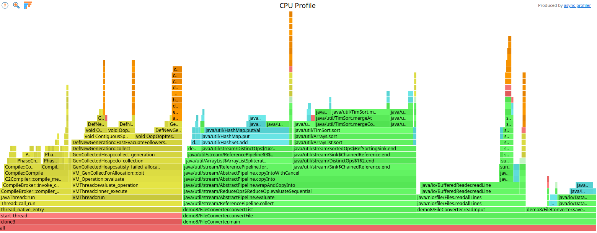

# Async-profiler

This project is a low overhead sampling profiler for Java
that does not suffer from the [Safepoint bias problem](http://psy-lob-saw.blogspot.ru/2016/02/why-most-sampling-java-profilers-are.html).
It features HotSpot-specific API to collect stack traces
and to track memory allocations. The profiler works with
OpenJDK and other Java runtimes based on the HotSpot JVM.

Unlike traditional Java profilers, async-profiler monitors non-Java threads
(e.g., GC and JIT compiler threads) and shows native and kernel frames in stack traces.

What can be profiled:

- CPU time
- Allocations in Java Heap
- Contented locks
- Hardware and software performance counters like cache misses, page faults, context switches
- and [more](docs/ProfilingModes.md).

See our [3 hours playlist](https://www.youtube.com/playlist?list=PLNCLTEx3B8h4Yo_WvKWdLvI9mj1XpTKBr)
to learn about more features.

# Download

Current release (3.0):

- Linux x64: [async-profiler-3.0-linux-x64.tar.gz](https://github.com/async-profiler/async-profiler/releases/download/v3.0/async-profiler-3.0-linux-x64.tar.gz)
- Linux arm64: [async-profiler-3.0-linux-arm64.tar.gz](https://github.com/async-profiler/async-profiler/releases/download/v3.0/async-profiler-3.0-linux-arm64.tar.gz)
- macOS x64/arm64: [async-profiler-3.0-macos.zip](https://github.com/async-profiler/async-profiler/releases/download/v3.0/async-profiler-3.0-macos.zip)
- Converters between profile formats: [converter.jar](https://github.com/async-profiler/async-profiler/releases/download/v3.0/converter.jar)  
  (JFR to Flame Graph, JFR to pprof, collapsed stacks to Flame Graph)

[Previous releases](https://github.com/async-profiler/async-profiler/releases)

[Nightly releases](https://github.com/async-profiler/async-profiler/releases/tag/nightly) (published on each commit to master)

For the build corresponding to a previous commit, go to
[Nightly Builds](https://github.com/async-profiler/async-profiler/actions/workflows/test-and-publish-nightly.yml),
click the desired build and scroll down to the artifacts section. These binaries are kept for 30 days.

# Supported platforms

|           | Officially maintained builds | Other available ports                     |
|-----------|------------------------------|-------------------------------------------|
| **Linux** | x64, arm64                   | x86, arm32, ppc64le, riscv64, loongarch64 |
| **macOS** | x64, arm64                   |                                           |

# Quick start

In a typical use case, profiling a Java application is just a matter of a running `asprof` with a PID of a
running Java process.
```
$ asprof -d 30 -f /tmp/flamegraph.html <PID>
```
The above command translates to: run profiler for 30 seconds and save results to `/tmp/flamegraph.html`
as an interactive `Flame Graph` that can be viewed in a browser.

[](https://htmlpreview.github.io/?.assets/html/flamegraph.html)

# Documentation

## Basic usage

* [Getting Started](docs/GettingStarted.md)
* [Profiler Options](docs/ProfilerOptions.md)
* [Profiling Modes](docs/ProfilingModes.md)
* [Integrating async-profiler](docs/IntegratingAsyncProfiler.md)
* [Profiling In Container](docs/ProfilingInContainer.md)

## Profiler output

* [Output Formats](docs/OutputFormats.md)
* [FlameGraph Interpretation](docs/FlamegraphInterpretation.md)
* [JFR Visualization](docs/JfrVisualization.md)
* [Converter Usage](docs/ConverterUsage.md)

## Advanced usage

* [CPU Sampling Engines](docs/CpuSamplingEngines.md)
* [Stack Walking Modes](docs/StackWalkingModes.md)
* [Advanced Stacktrace Features](docs/AdvancedStacktraceFeatures.md)
* [Profiling Non-Java Applications](docs/ProfilingNonJavaApplications.md)

## Troubleshooting

For known issues faced while running async-profiler and their detailed troubleshooting,
please refer [here](docs/Troubleshooting.md).
