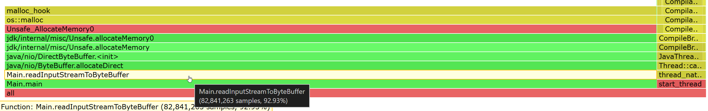

# Profiling modes

Besides CPU time, async-profiler provides various other profiling modes such as `Allocation`, `Wall Clock`, `Java Method`
and even a `Multiple Events` profiling mode.

## CPU profiling

In this mode, profiler collects stack trace samples that include **Java** methods,
**native** calls, **JVM** code and **kernel** functions.

The general approach is receiving call stacks generated by `perf_events`
and matching them up with call stacks generated by `AsyncGetCallTrace`,
in order to produce an accurate profile of both Java and native code.
Additionally, async-profiler provides a workaround to recover stack traces
in some [corner cases](https://bugs.openjdk.java.net/browse/JDK-8178287)
where `AsyncGetCallTrace` fails.

This approach has the following advantages compared to using `perf_events`
directly with a Java agent that translates addresses to Java method names:

- Does not require `-XX:+PreserveFramePointer`, which introduces
  performance overhead that can be sometimes as high as 10%.

- Does not require starting JVM with an agent for translating Java code addresses
  to method names.

- Displays interpreter frames.

- Does not produce large intermediate files (perf.data) for further processing in
  user space scripts.

If you wish to resolve frames within `libjvm`, the [debug symbols](#installing-debug-symbols) are required.

## ALLOCATION profiling

The profiler can be configured to collect call sites where the largest amount
of heap memory is allocated.

async-profiler does not use intrusive techniques like bytecode instrumentation
or expensive DTrace probes which have significant performance impact.
It also does not affect Escape Analysis or prevent from JIT optimizations
like allocation elimination. Only actual heap allocations are measured.

The profiler features TLAB-driven sampling. It relies on HotSpot-specific
callbacks to receive two kinds of notifications:

- when an object is allocated in a newly created TLAB;
- when an object is allocated on a slow path outside TLAB.

Sampling interval can be adjusted with `--alloc` option.
For example, `--alloc 500k` will take one sample after 500 KB of allocated
space on average. Prior to JDK 11, intervals less than TLAB size will not take effect.

In allocation profiling mode, the top frame of every call trace is the class
of the allocated object, and the counter is the heap pressure (the total size
of allocated TLABs or objects outside TLAB).

### Installing Debug Symbols

Prior to JDK 11, the allocation profiler required HotSpot debug symbols.
Some OpenJDK distributions (Amazon Corretto, Liberica JDK, Azul Zulu)
already have them embedded in `libjvm.so`, other OpenJDK builds typically
provide debug symbols in a separate package. For example, to install
OpenJDK debug symbols on Debian / Ubuntu, run:

```
# apt install openjdk-17-dbg
```

(replace `17` with the desired version of JDK).

On CentOS, RHEL and some other RPM-based distributions, this could be done with
[debuginfo-install](http://man7.org/linux/man-pages/man1/debuginfo-install.1.html) utility:

```
# debuginfo-install java-1.8.0-openjdk
```

On Gentoo, the `icedtea` OpenJDK package can be built with the per-package setting
`FEATURES="nostrip"` to retain symbols.

The `gdb` tool can be used to verify if debug symbols are properly installed for the `libjvm` library.
For example, on Linux:

```
$ gdb $JAVA_HOME/lib/server/libjvm.so -ex 'info address UseG1GC'
```

This command's output will either contain `Symbol "UseG1GC" is at 0xxxxx`
or `No symbol "UseG1GC" in current context`.

## Native memory leaks

The profiling mode `nativemem` records `malloc`, `realloc`, `calloc` and `free` calls
with the addresses, so that allocations can be matched with frees. This helps to focus
the profile report only on unfreed allocations, which are the likely to be a source of a memory leak.

Example:

```
asprof start -e nativemem -f app.jfr <YourApp>
# or
asprof start --nativemem N -f app.jfr <YourApp>

asprof stop <YourApp>
```

Now we need to process the jfr file, to find native memory leaks:

```
# --total for bytes, default counts invocations.
jfrconv --total --nativemem --leak app.jfr app-leak.html

# No leak analysis, include all native allocations:
jfrconv --total --nativemem app.jfr app-malloc.html
```

When `--leak` option is used, the generated flame graph will show allocations without matching `free` calls:



The overhead of `nativemem` profiling depends on the number of native allocations,
but is usually small enough even for production use. If required, the overhead can be reduced
by configuring the profiling interval. E.g. if you add `nativemem=1m` profiler option,
allocation samples will be limited to at most one sample per allocated megabyte.

## Wall-clock profiling

`-e wall` option tells async-profiler to sample all threads equally every given
period of time regardless of thread status: Running, Sleeping or Blocked.
For instance, this can be helpful when profiling application start-up time.

Wall-clock profiler is most useful in per-thread mode: `-t`.

Example: `asprof -e wall -t -i 50ms -f result.html 8983`

## Lock profiling

`-e lock` option tells async-profiler to measure lock contention in the profiled application. Lock profiling can help
developers understand lock acquisition patterns, lock contention (when threads have to wait to acquire locks), time
spent waiting for locks and which code paths are blocked due to locks.

In lock profiling mode, the top frame is the class of lock/monitor, and the counter is number of nanoseconds it took to
enter this lock/monitor.

Example: `asprof -e lock -t -i 5ms -f result.html 8983`

## Java method profiling

`-e ClassName.methodName` option instruments the given Java method
in order to record all invocations of this method with the stack traces.

Example: `-e java.util.Properties.getProperty` will profile all places
where `getProperty` method is called from.

Only non-native Java methods are supported. To profile a native method,
use hardware breakpoint event instead, e.g. `-e Java_java_lang_Throwable_fillInStackTrace`

**Be aware** that if you attach async-profiler at runtime, the first instrumentation
of a non-native Java method may cause the [deoptimization](https://github.com/openjdk/jdk/blob/bf2e9ee9d321ed289466b2410f12ad10504d01a2/src/hotspot/share/prims/jvmtiRedefineClasses.cpp#L4092-L4096)
of all compiled methods. The subsequent instrumentation flushes only the _dependent code_.

The massive CodeCache flush doesn't occur if attaching async-profiler as an agent.

### Java native method profiling

Here are some useful native methods to profile:

- `G1CollectedHeap::humongous_obj_allocate` - trace _humongous allocations_ of the G1 GC,
- `JVM_StartThread` - trace creation of new Java threads,
- `Java_java_lang_ClassLoader_defineClass1` - trace class loading.

## Multiple events

It is possible to profile CPU, allocations, and locks at the same time.
Instead of CPU, you may choose any other execution event: wall-clock,
perf event, tracepoint, Java method, etc.

The only output format that supports multiple events together is JFR.
The recording will contain the following event types:

- `jdk.ExecutionSample`
- `jdk.ObjectAllocationInNewTLAB` (alloc)
- `jdk.ObjectAllocationOutsideTLAB` (alloc)
- `jdk.JavaMonitorEnter` (lock)
- `jdk.ThreadPark` (lock)

To start profiling cpu + allocations + locks together, specify

```
asprof -e cpu,alloc,lock -f profile.jfr ...
```

or use `--alloc` and `--lock` parameters with the desired threshold:

```
asprof -e cpu --alloc 2m --lock 10ms -f profile.jfr ...
```

The same, when starting profiler as an agent:

```
-agentpath:/path/to/libasyncProfiler.so=start,event=cpu,alloc=2m,lock=10ms,file=profile.jfr
```

## Continuous profiling

Continuous profiling is a means by which an application can be profiled
continuously and dump profile results every specified time period.
It is a very effective technique in finding performance degradations proactively
and efficiently. Continuous profiling helps users to understand performance
differences between versions of the same application. Recent outputs can
be compared with continuous profiling output history to find differences
and optimize the changes introduced in case of performance degradations.
aysnc-profiler provides the ability to continously profile an application with
the `loop` option. Make sure the filename includes a timestamp pattern, or the
output will be overwritten on each iteration.

```
asprof --loop 1h -f /var/log/profile-%t.jfr 8983
```

## Special event types supported on Linux

Below special event types are supported on Linux:

- `-e mem:<func>[:rwx]` sets read/write/exec breakpoint at function
  `<func>`. The format of `mem` event is the same as in [`perf-record`](https://man7.org/linux/man-pages/man1/perf-record.1.html).
  Execution breakpoints can be also specified by the function name,
  e.g. `-e malloc` will trace all calls of native `malloc` function.
- `-e trace:<id>` sets a kernel tracepoint. It is possible to specify
  tracepoint symbolic name, e.g. `-e syscalls:sys_enter_open` will trace
  all `open` syscalls.
- Raw PMU event, e.g. `-e r4d2` selects `MEM_LOAD_L3_HIT_RETIRED.XSNP_HITM` event, which corresponds to event 0xd2, umask 0x4
- PMU event descriptor, e.g. `-e cpu/event=0xd2,umask=4/`. The same syntax can be used for uncore and vendor-specific events, e.g. `amd_l3/event=0x01,umask=0x80/`
- Symbolic name of a dynamic PMU event, e.g. `-e cpu/topdown-fetch-bubbles/`
- kprobe/kretprobe, e.g. `-e kprobe:do_sys_open`, `-e kretprobe:do_sys_open`
- uprobe/uretprobe, e.g. `-e uprobe:/usr/lib64/libc-2.17.so+0x114790`
